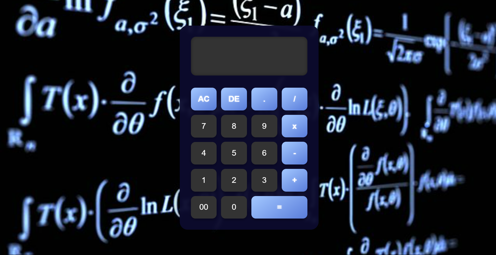

# 🧮 Calculadora Web

Una calculadora simple, moderna y funcional creada con **HTML**, **CSS** y **JavaScript**. Ideal para practicar desarrollo web y lógica básica de programación, cread por Euge y Maik.

## ✨ Características

- Interfaz limpia y responsive
- Realiza operaciones básicas: suma, resta, multiplicación y división
- Botones de limpiar (AC), borrar (DE), decimal (.) y resultado (=)
- Estilos atractivos con efectos al pasar el mouse
- Fondo matemático para un toque especial

## 📸 Vista previa

![Vista previa de la calculadora]


## 🚀 Cómo usar

1. Clona este repositorio:
   ```bash
   git clone https://github.com/tu-usuario/nombre-del-repo.git
